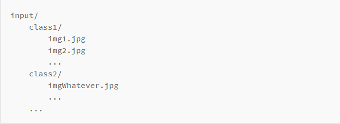
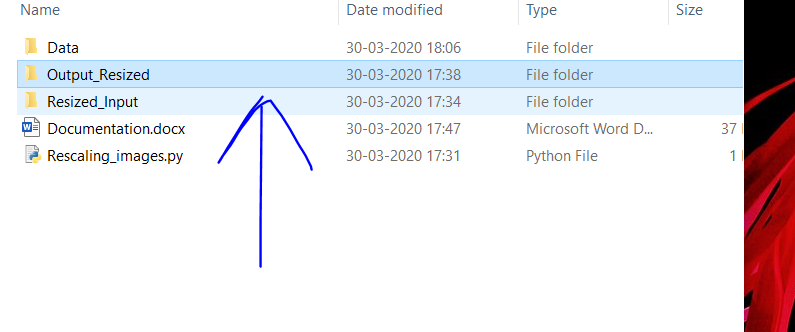
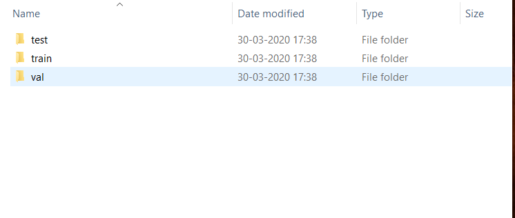
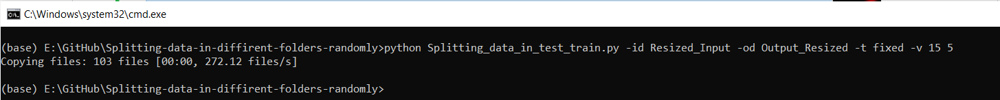

# Splitting-data-in-diffirent-folders-randomly
This Script will Randomly split your data from a directory to a diffirent directory with cleanly split into:   
<b> Test,Train and Validation folders</b>   

<i><b> This tool will help your training model a lot easier</b></i>   

eg.   
<b>Initial State</b> :    


<b>Final State</b> :   

   
   
      
# How to Run   
1. Do 
  >'pip install split-folders' on your terminal   
2. Save this script in the <b>root folder of your project</b> where you have data folder
3. Open terminal there
4. > 'python Splitting_data_in_test_train.py -h' to get the description of the parameters you need to give   

```
-id : input directory having unsorted data      
-od : output directory name to store test,train and validation      
-t  : specifies type ie:   
      a) 'fixed' : splits data as per the fixed no as specified in value   
      b) 'ratio' : splits data as per the ratio as specified in value   
-v  : need to pass 2 arguments separated by a space    
      a) 1st argument : amount of data in validation   
      b) 2nd argument : amount of data in test   
```
5. <b>DONE,ENJOY</B>

# Screenshots examples   
   
   
   <b> FOR THIS :</B>   
   1. <b>Validation</b> : <b>15</b> pictures   
   2. <b>Test</b>       : <b>5</b> pictures   
   3. <b>Train</b>      : <b>REST EVERYTHING</b> pictures
   
